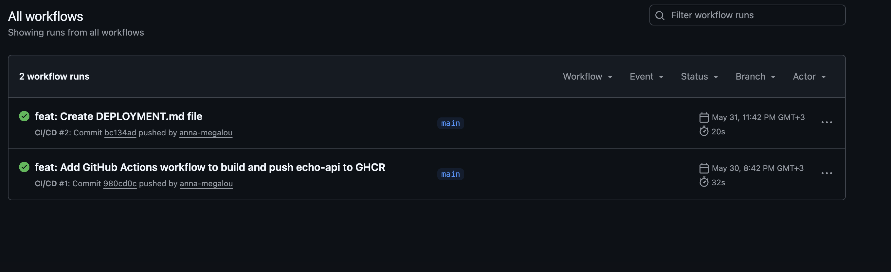
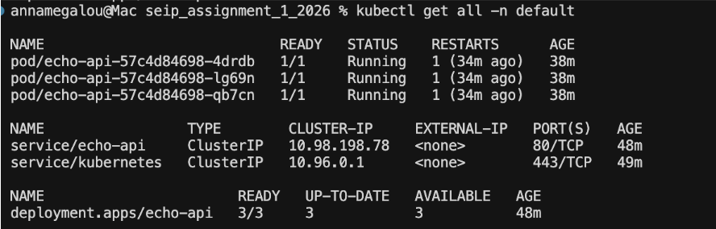
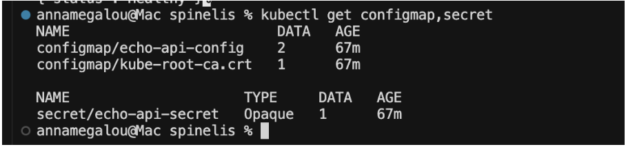
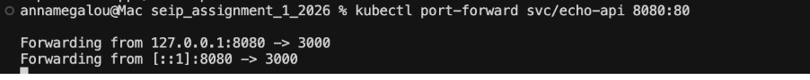
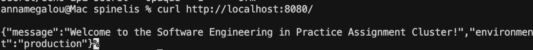
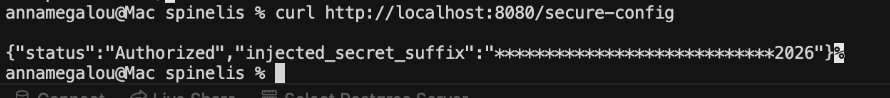
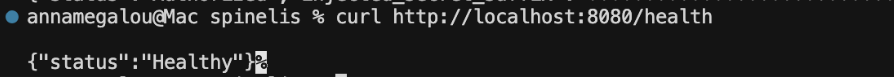
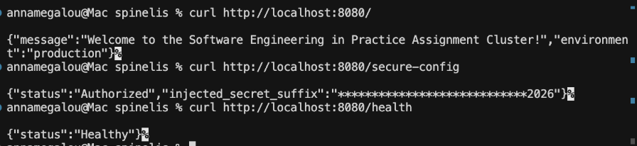

# Software Engineering in Practice - Assignment 1

## Advanced DevOps: Production-Grade CI/CD, External Configuration and Orchestration

| Field | Details |
| :--- | :--- |
| **Student** | Anna Maria Megalou |
| **AM** | t8230094 |
| **GitHub Repository** | [https://github.com/anna-megalou/seip_assignment_1_2026](https://github.com/anna-megalou/seip_assignment_1_2026) |
| **Application name** | echo-api |
| **Technology stack** | Node.js / Express, Docker, GitHub Actions, GitHub Container Registry, Kubernetes, Minikube |

---

## Table of Contents

1. [Introduction](#1-introduction)
2. [GitHub Repository Evidence](#2-github-repository-evidence)
3. [Containerization](#3-containerization)
4. [CI/CD Pipeline with GitHub Actions](#4-cicd-pipeline-with-github-actions)
5. [Kubernetes Configuration and Orchestration](#5-kubernetes-configuration-and-orchestration)
   - 5.1 [ConfigMap](#51-configmap)
   - 5.2 [Secret](#52-secret)
   - 5.3 [Deployment](#53-deployment)
   - 5.4 [Service](#54-service)
6. [Cluster State Proof](#6-cluster-state-proof)
7. [Port Forwarding Proof](#7-port-forwarding-proof)
8. [Application Verification Proof](#8-application-verification-proof)
   - 8.1 [Root Endpoint](#81-root-endpoint)
   - 8.2 [Secure Configuration Endpoint](#82-secure-configuration-endpoint)
   - 8.3 [Health Endpoint](#83-health-endpoint)
9. [AI Usage and Future Engineering Report](#9-ai-usage-and-future-engineering-report)
   - 9.1 [AI Integration](#91-ai-integration)
   - 9.2 [Utility Analysis](#92-utility-analysis)
   - 9.3 [Friction Points](#93-friction-points)
   - 9.4 [Future Architectural Outlook](#94-future-architectural-outlook)
10. [Conclusion](#10-conclusion)

---

## 1. Introduction

The purpose of this assignment was to create a complete automated deployment pipeline for a cloud-native web application. The application is a simple Node.js Express API that reads its configuration from environment variables. The main engineering task was not to change the application logic, but to build the infrastructure around it.

The solution includes:

- A production-ready Dockerfile for containerizing the application
- A GitHub Actions CI/CD workflow that builds and pushes the Docker image to GitHub Container Registry
- Kubernetes manifests for deploying the application to a local Minikube cluster
- External configuration using a Kubernetes ConfigMap
- Secret injection using a Kubernetes Secret
- A Kubernetes Deployment with three replicas, resource limits, readiness probe, and liveness probe
- A ClusterIP Service that exposes the application inside the cluster
- Validation using kubectl, port-forward, and curl

---

## 2. GitHub Repository Evidence

The public repository for this assignment is:

[https://github.com/anna-megalou/seip_assignment_1_2026](https://github.com/anna-megalou/seip_assignment_1_2026)

The repository contains all required files:

- `Dockerfile`
- `.github/workflows/ci-cd.yaml`
- `k8s/configmap.yaml`
- `k8s/secret.yaml`
- `k8s/deployment.yaml`
- `k8s/service.yaml`
- `server.js`
- `package.json`
- `DEPLOYMENT.md`

The repository is public and includes both the application code and all infrastructure files required to build, publish, and deploy the application.

---

## 3. Containerization

The application was containerized using a Dockerfile placed at the root of the repository.

The Dockerfile uses `node:18-alpine` as a lightweight base image. This keeps the final container image smaller and more suitable for deployment. The working directory is set to `/app`, and the dependency files are copied before the rest of the source code. This improves Docker layer caching because dependencies are only reinstalled when `package.json` or `package-lock.json` changes.

The Dockerfile also exposes port `3000`, which is the internal port used by the Express application. Finally, the container starts the application using `npm start`.

This satisfies the containerization requirement because the application can be built into a Docker image and executed as an isolated container.

---

## 4. CI/CD Pipeline with GitHub Actions

The project includes a GitHub Actions workflow located at `.github/workflows/ci-cd.yaml`.

The workflow is triggered when code is pushed to the `main` branch. The pipeline performs the following steps:

1. Checks out the repository code
2. Authenticates to GitHub Container Registry using the built-in `GITHUB_TOKEN`
3. Builds the Docker image from the root Dockerfile
4. Tags the image as: `ghcr.io/anna-megalou/echo-api:latest`
5. Pushes the image to GitHub Container Registry

This automates the build and publishing process, meaning that every push to `main` can produce a new deployable Docker image.



**Explanation:** The screenshot shows that the CI/CD workflow completed successfully. The workflow run is marked with a green success icon, which confirms that the Docker image was built and pushed to GitHub Container Registry without errors.

---

## 5. Kubernetes Configuration and Orchestration

The Kubernetes manifests are stored inside the `k8s/` directory. They can be applied together using:

```bash
kubectl apply -f k8s/
```

The Kubernetes setup includes four main resources:

### 5.1 ConfigMap

The ConfigMap is named: `echo-api-config`

It stores non-sensitive configuration values:

- `WELCOME_MESSAGE`
- `NODE_ENV`

The welcome message used by the application is:

> Welcome to the Software Engineering in Practice Assignment Cluster!

The environment is set to: `production`

This follows the principle of externalized configuration because the application does not hardcode these values inside the source code.

### 5.2 Secret

The Secret is named: `echo-api-secret`

It stores the sensitive value: `API_SECRET_KEY`

The value is stored in Base64-encoded form inside the Kubernetes Secret manifest. The application receives the decoded value at runtime through environment variable injection.

The secret is not printed in full by the application. Instead, the `/secure-config` endpoint only returns a masked version of the secret, showing only the final suffix. This proves that the Secret was injected successfully without exposing the full sensitive value.

### 5.3 Deployment

The Deployment is named: `echo-api`

It deploys the application using the image: `ghcr.io/anna-megalou/echo-api:latest`

The Deployment is configured with exactly three replicas. This means Kubernetes runs three instances of the application pod.

The Deployment also defines resource requests and limits:

- CPU request: `100m`
- Memory request: `128Mi`
- CPU limit: `250m`
- Memory limit: `256Mi`

The Deployment injects environment variables from both the ConfigMap and the Secret. This allows the Express application to read the required runtime configuration.

The Deployment also includes:

- A liveness probe on `/health`
- A readiness probe on `/health`

Both probes target port `3000`, which is the internal container port of the application.

### 5.4 Service

The Service is named: `echo-api`

It is configured as a ClusterIP service. This means the application is exposed inside the Kubernetes cluster but not directly exposed to the host machine or the public internet.

The Service maps:

- Service port: `80`
- Container target port: `3000`

This allows internal cluster traffic to reach the Express application.

---

## 6. Cluster State Proof

After applying the Kubernetes manifests, I verified the cluster state using:

```bash
kubectl get all -n default
```



**Explanation:** The screenshot confirms that the Kubernetes resources were created successfully. It shows three running pods for the echo-api application. Each pod has status Running and readiness 1/1, which means the containers are healthy and ready to serve traffic.

The screenshot also shows the echo-api Service as a ClusterIP service. The Deployment is ready with 3/3 replicas, confirming that the required number of application instances is running.

This proves that the application was successfully orchestrated inside the Minikube Kubernetes cluster.

Verification command:

```bash
kubectl get configmap,secret
```



**Explanation:** This screenshot shows the Kubernetes ConfigMap and Secret resources created in the default namespace:

- `configmap/echo-api-config`
- `secret/echo-api-secret`

This proves that the external configuration and secret management resources were created successfully in the cluster.

---

## 7. Port Forwarding Proof

Because the application Service is a ClusterIP, it is only reachable inside the Kubernetes cluster. To access it from the local machine, I used port forwarding:

```bash
kubectl port-forward svc/echo-api 8080:80
```



**Explanation:** The screenshot shows that local port 8080 is forwarded to the Kubernetes service. This makes the application available locally through `http://localhost:8080`. The port-forward command must remain running while testing the application endpoints.

---

## 8. Application Verification Proof

### 8.1 Root Endpoint

**Command:**

```bash
curl http://localhost:8080/
```

**Response:**

```json
{
  "message": "Welcome to the Software Engineering in Practice Assignment Cluster!",
  "environment": "production"
}
```



**Explanation:** This response proves that the application is running and that the `WELCOME_MESSAGE` and `NODE_ENV` values were successfully injected from the Kubernetes ConfigMap.

### 8.2 Secure Configuration Endpoint

**Command:**

```bash
curl http://localhost:8080/secure-config
```

**Response:**

```json
{
  "status": "Authorized",
  "injected_secret_suffix": "************************2026"
}
```



**Explanation:** This response proves that the Kubernetes Secret was successfully injected into the application. The endpoint returns `Authorized`, which means the application did not fall back to the insecure default secret. The secret is masked, so the full sensitive value is not exposed.

### 8.3 Health Endpoint

**Command:**

```bash
curl http://localhost:8080/health
```

**Response:**

```json
{
  "status": "Healthy"
}
```



**Explanation:** This response proves that the `/health` endpoint is working correctly. This same endpoint is also used by the Kubernetes readiness and liveness probes.



**Explanation:** The screenshot shows successful responses from all required application endpoints. The root endpoint confirms ConfigMap injection, the secure endpoint confirms Secret injection, and the health endpoint confirms that the application is healthy.

---

## 9. AI Usage and Future Engineering Report

### 9.1 AI Integration

I used ChatGPT as a supporting tool during the assignment. I did not use it to blindly generate the whole solution. Instead, I used it mainly when I needed help understanding specific DevOps concepts or debugging errors.

The main areas where I used AI assistance were:

- Understanding how a Dockerfile should be structured for a Node.js application
- Checking the correct structure of a GitHub Actions workflow
- Understanding how to authenticate to GitHub Container Registry using `GITHUB_TOKEN`
- Understanding Kubernetes ConfigMaps and Secrets
- Checking how to inject ConfigMap and Secret values as environment variables inside a Deployment
- Understanding the difference between container port, service port, and local port-forwarding port
- Debugging Kubernetes-related problems such as image pulling, pod readiness, and service access

After receiving AI suggestions, I manually checked the results against the assignment requirements, the repository files, and the actual terminal output. I also validated the implementation using kubectl, port-forward, and curl.

### 9.2 Utility Analysis

The most useful part of the AI assistance was the explanation of Kubernetes manifest structure. Kubernetes YAML files can be confusing because indentation and field placement are very important. AI helped me understand where fields such as `configMapKeyRef`, `secretKeyRef`, `resources`, `livenessProbe`, and `readinessProbe` should be placed.

AI was also useful for understanding Base64 encoding for Kubernetes Secrets. In particular, it helped me understand that hidden newline characters can affect the encoded value. This was important because the application checks whether the production secret is correctly injected.

Another useful area was troubleshooting. When something did not work, AI helped me interpret possible causes, such as:

- The image being private in GHCR
- A wrong image name or tag
- A mismatch between Service selectors and pod labels
- A wrong target port
- A Secret not being injected correctly

However, I still verified the final behavior myself by running the application and checking the real outputs.

### 9.3 Friction Points

One friction point was that AI can sometimes give generic answers that do not exactly match the assignment. For example, it may suggest using an Ingress or LoadBalancer, while the assignment specifically asks for a ClusterIP service and port forwarding.

Another friction point was that some explanations around ports can be confusing. In this project, the application listens on container port 3000, the Kubernetes Service exposes port 80, and the local machine accesses it through port 8080. I had to manually verify this using:

```bash
kubectl port-forward svc/echo-api 8080:80
```

and then testing:

```bash
curl http://localhost:8080/
```

I also had to make sure that the GitHub Container Registry image was accessible to Minikube. If the image is private, Kubernetes may fail with `ImagePullBackOff`. This required manual checking in GitHub Packages and Kubernetes pod status.

Overall, AI was useful as a guide, but the final confirmation came from actual terminal commands and successful application responses.

### 9.4 Future Architectural Outlook

If I had one extra week, I would improve the system in several ways to make it closer to a real production environment.

First, I would replace manual port forwarding with an Ingress Controller. This would allow the application to be accessed through a proper HTTP route instead of requiring a terminal command to stay open.

Second, I would add image scanning to the CI/CD pipeline. A tool such as Trivy could scan the Docker image for known vulnerabilities before the image is pushed or deployed.

Third, I would avoid relying on the `latest` tag for production deployments. Instead, I would tag each image using the Git commit SHA or a semantic version. This would make deployments more traceable and easier to roll back.

Fourth, I would add a staging environment. This could be implemented using a separate Kubernetes namespace with its own ConfigMap and Secret. The application could then be tested in staging before being deployed to production.

Fifth, I would add monitoring and observability. For example, Prometheus and Grafana could be used to monitor application health, CPU usage, memory usage, and request metrics.

Finally, I would consider a GitOps approach using a tool such as ArgoCD. This would allow Kubernetes deployments to be automatically synchronized from Git, making the deployment process more controlled, auditable, and production-ready.

---

## 10. Conclusion

This assignment demonstrates a complete DevOps workflow for a cloud-native application. The application was containerized with Docker, automatically built and pushed using GitHub Actions, and deployed to a local Kubernetes cluster using declarative manifests.

The final deployment successfully runs three healthy replicas, uses external configuration through a ConfigMap, injects sensitive data through a Secret, exposes the application internally through a ClusterIP Service, and verifies the application through port forwarding and curl requests.

Therefore, the submitted evidence demonstrates that the CI/CD pipeline, container image publication, Kubernetes orchestration, external configuration, secret injection, service exposure, and application verification were all completed successfully.
